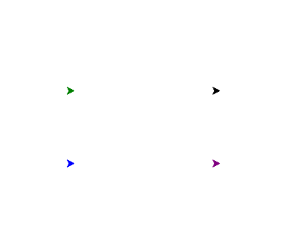
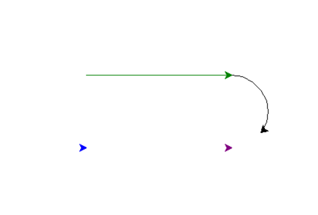
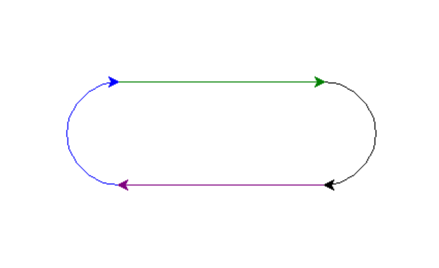
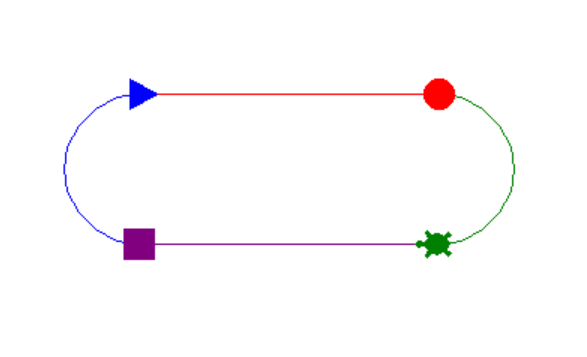

### **3-01：类的封装与实例化对象**⭐

**题目：** 对常规事物进行类的封装，并实例化对象。

如：电子产品已经是人们生活中的一部分了，尤其是手机，已经变成了人的一个“器官”。
请你封装一个手机类 Phone。每个手机都具有型号 model 属性，每个手机都能通过手机号拨打电话 call(number)。
实例化两部手机 huawei 和 xiaomi，并分别给不同的电话号码打电话。

**程序分析：** 封装类 fac()，使用 构造函数 设置对象属性，设置类方法，实例化对象。

```python
class Phone:
    def __init__(self,model):
        self.model = model

    def call(self,number):
        if len(number) == 11:
            print('正在呼叫{}...'.format(number))

huawei = Phone('huawei')
xiaomi = Phone('xiaomi')
huawei.call('12345678901')
xiaomi.call('12345678902')
```

### **3-02：类的继承**

**题目：** 对已有的类进行继承或者多态设置。常用的是 turtle模块 Turtle 类。

关于 turtle模块的文档，请查看官方文档说明：
<https://docs.python.org/zh-cn/3/library/turtle.html>

> 关于 turtle模块面向对象和面向过程绘图的说明：
    turtle 模块提供面向对象和面向过程两种形式的海龟绘图基本组件。由于它使用 tkinter 实现基本图形界面，因此需要安装了 Tk 支持的 Python 版本。

    面向对象的接口主要使用“2+2”个类：

    TurtleScreen 类定义图形窗口作为绘图海龟的运动场。它的构造器需要一个 tkinter.Canvas 或 ScrolledCanvas 作为参数。应在 turtle 作为某个程序的一部分的时候使用。

    Screen() 函数返回一个 TurtleScreen 子类的单例对象。此函数应在 turtle 作为独立绘图工具时使用。作为一个单例对象，其所属的类是不可被继承的。

    TurtleScreen/Screen 的所有方法还存在对应的函数，即作为面向过程的接口组成部分。

    RawTurtle (别名: RawPen) 类定义海龟对象在 TurtleScreen 上绘图。它的构造器需要一个 Canvas, ScrolledCanvas 或 TurtleScreen 作为参数，以指定 RawTurtle 对象在哪里绘图。

    从 RawTurtle 派生出子类 Turtle (别名: Pen)，该类对象在 Screen 实例上绘图，如果实例不存在则会自动创建。

    RawTurtle/Turtle 的所有方法也存在对应的函数，即作为面向过程的接口组成部分。

    过程式接口提供与 Screen 和 Turtle 类的方法相对应的函数。函数名与对应的方法名相同。当 Screen 类的方法对应函数被调用时会自动创建一个 Screen 对象。当 Turtle 类的方法对应函数被调用时会自动创建一个 (匿名的) Turtle 对象。

    **如果屏幕上需要有多个海龟，就必须使用面向对象的接口。**

题目：使用 turtle模块面向对象的绘图形式绘制以下图形：





```python
# 方法一：直接根据 Turtle 类实例化 4 个对象
import turtle
import time

p1 = turtle.Turtle()
p2 = turtle.Turtle()
p3 = turtle.Turtle()
p4 = turtle.Turtle()

p1.color('red')
p1.color('green')
p3.color('purple')
p4.color('blue')

p1.penup()
p2.penup()
p3.penup()
p4.penup()

p1.goto(-100,50)
p2.goto(100,50)
p3.goto(100,-50)
p4.goto(-100,-50)

p1.pendown()
p2.pendown()
p3.pendown()
p4.pendown()

time.sleep(2)

p1.forward(200)
p2.circle(-50,180)
p3.seth(180)
p3.forward(200)
p4.seth(180)
p4.circle(-50,180)

turtle.done()
```

```python
# 方法二：创建 Turtle子类，封装四个对象的类
from turtle import Turtle
import turtle
import time

class my_turtle(Turtle):
    def __init__(self,shape,color,x,y):
        Turtle.__init__(self)
        self.shape(shape)
        self.color(color)
        self.penup()
        self.goto(x,y)
        self.pendown()

p1 = my_turtle('circle','red',-100,50)
p2 = my_turtle('turtle','green',100,50)
p3 = my_turtle('square','purple',100,-50)
p4 = my_turtle('triangle','blue',-100,-50)

time.sleep(2)

p1.forward(200)
p2.circle(-50,180)
p3.seth(180)
p3.forward(200)
p4.seth(180)
p4.circle(-50,180)

turtle.done()

```




### **3-03：文件读写**

**题目：** 读写 txt 文本文档，注意中文内容需要使用 `encoding='utf-8'` 进行编译。

如：本地 《体温记录.txt》文本文档，具有以下内容：

> 星期一,36.4℃
> 星期二,36.1℃
> 星期三,36.7℃
> 星期四,37.1℃
> 星期五,36.4℃
> 星期六,36.2℃
> 星期日,36.5℃

请你对文本文档内容进行读取，并计算一周中是否有发热现象（体温大于37.2℃）。注意：文档中的逗号为英文逗号。

```python
f = open(r'体温记录.txt','r',encoding='utf-8')
records = f.readlines()
f.close()
print(records)  # ['星期一,36.4℃\n', '星期二,36.1℃\n', '星期三,36.7℃\n', '星期四,37.1℃\n', '星期五,36.4℃\n', '星期六,36.2℃\n', '星期日,36.5℃']
tmps = []
for record in records:
    tmp = eval(record[4:8])
    tmps.append(tmp)

print(tmps)  # [36.4, 36.1, 36.7, 37.1, 36.4, 36.2, 36.5]
if max(tmps) > 37.2:
    print(f'这一周有发烧迹象，最大值是{max(tmps)}℃')
else:
    print(f'这一周无发烧迹象，最大值是{max(tmps)}℃')
```
