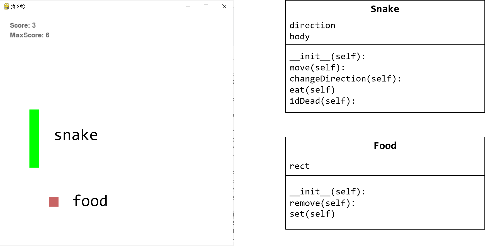
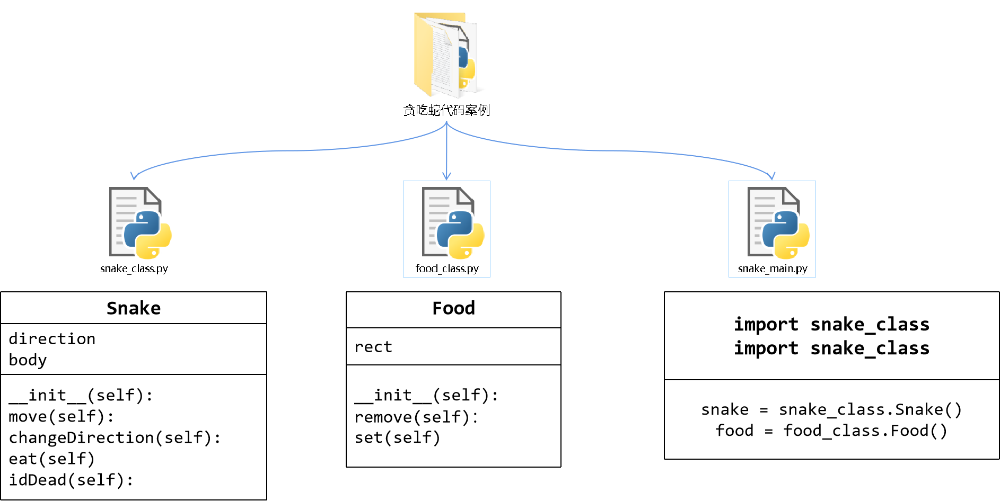

# **Lesson-13-14**

## 贪吃蛇

贪吃蛇游戏分析：





> **snake_class.py**

- 创建蛇类的文件

```python
import pygame

WIDTH = 600
HEIGHT = 600

# 定义蛇类
class Snakes:
    def __init__(self):
        self.direction = pygame.K_RIGHT
        self.body = [(50,50),(75,50),(100,50)]

    def move(self):
        # 画头部
        left = self.body[-1][0]
        top = self.body[-1][1]
        head = pygame.Rect(left, top, 25, 25)

        # 蛇头移动方向
        if self.direction == pygame.K_RIGHT:
            head.left += 25
        elif self.direction == pygame.K_LEFT:
            head.left -= 25
        elif self.direction == pygame.K_UP:
            head.top -= 25
        elif self.direction == pygame.K_DOWN:
            head.top += 25

        self.body.append(head)

        self.body.pop(0)
        
    def changeDirection(self,curkey):
        L_R = [pygame.K_LEFT, pygame.K_RIGHT]
        U_D = [pygame.K_UP, pygame.K_DOWN]
        if curkey in L_R + U_D:
            if (curkey in L_R) and (self.direction in L_R):
                return
            elif (curkey in U_D) and (self.direction in U_D):
                return
            else:
                self.direction = curkey
                
    def isDead(self):
        # 死亡方法
        if self.body[-1][0] not in range(WIDTH):
            return True
        elif self.body[-1][1] not in range(HEIGHT):
            return True
        elif self.body[-1] in self.body[:-1]:
            return True
        else:
            return False
    def eat(self):
        self.body.insert(0,self.body[0])
```


> **food_class.py**

- 创建食物类的文件

```python
import pygame
import random

WIDTH = 600
HEIGHT = 600

class Food:
    def __init__(self):
        self.rect = pygame.Rect(-25, 0, 25, 25) # 初始位置
        
    def remove(self):
        self.rect.left = -25

    def set(self):
        if self.rect.left == -25:
            allpos = []
            for pos in range(25, WIDTH-25, 25):
                allpos.append(pos)
            self.rect.left = random.choice(allpos)
            self.rect.top = random.choice(allpos)
```

> **snake_main.py**

- 游戏主文件

```python

import pygame
import snake_class
import food_class

WIDTH = 600
HEIGHT = 600

def showText(screen, pos, text, color, size):
    cur_font = pygame.font.SysFont('黑体', size)
    cur_text = cur_font.render(text, 1, color)
    screen.blit(cur_text, pos)

def main():
    pygame.init()
    screen = pygame.display.set_mode((WIDTH, HEIGHT))
    pygame.display.set_caption('贪吃蛇')
    screen.fill((255,255,255))
    
    scores = [0]
    f = open('scores.txt','r')
    for i in f.read().split('\n'):
        if i != '':
            scores.append(int(i))
    max_score = max(scores)
    f.close    

    snake = snake_class.Snakes()
    food = food_class.Food()
    
    isDead = False
    score = 0
        
    clock = pygame.time.Clock()
    
    while True:
        screen.fill((255,255,255))

        for event in pygame.event.get():
            if event.type == pygame.QUIT:
                exit()
            
            if event.type == pygame.KEYDOWN:
                snake.changeDirection(event.key)
                if event.key == pygame.K_SPACE and isDead:
                    with open('scores.txt','a+') as f:
                        f.write('{}\n'.format(score))
                    return main()
                if event.key == pygame.K_q:
                    exit()
 
        isDead = snake.isDead()
        
        if not isDead:
            snake.move()
            for i in snake.body:
                node = pygame.Rect(i[0], i[1], 25, 25)
                pygame.draw.rect(screen, (0,255,0), node)
        else:
            showText(screen, (100,200), 'YOU DEAD!', (200,20,20), 100)
            showText(screen, (150,300), 'Press space to try again...', (0,0,255), 30)
            showText(screen, (150,350), 'Press Q to exit...', (0,0,255), 30)

        food.set()
        pygame.draw.rect(screen,(200,100,100),food.rect,0)    
        if food.rect == snake.body[-1]:
            score += 1
            food.remove()
            snake.eat()

        showText(screen, (25,50), 'MaxScore: {}'.format(max_score), (100,100,100), 25)
        showText(screen, (25,25), 'Score: {}'.format(score), (100,100,100), 25)
        pygame.display.flip()
        clock.tick(10)

main()

```