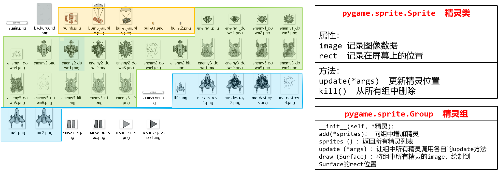
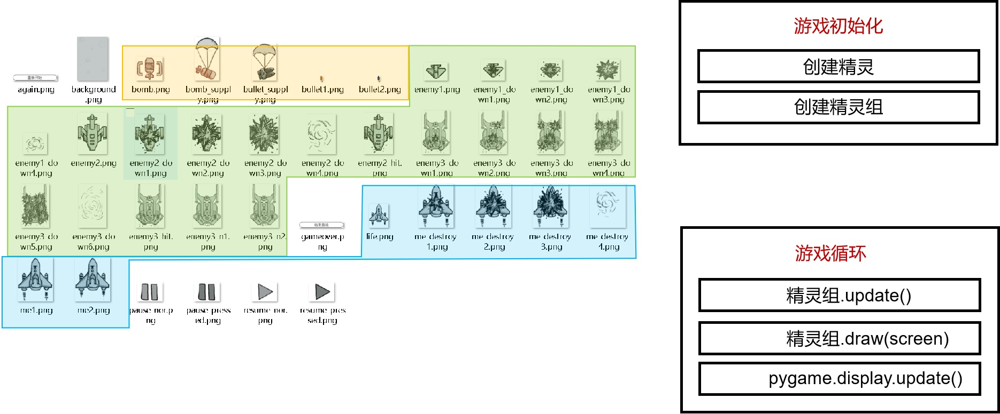
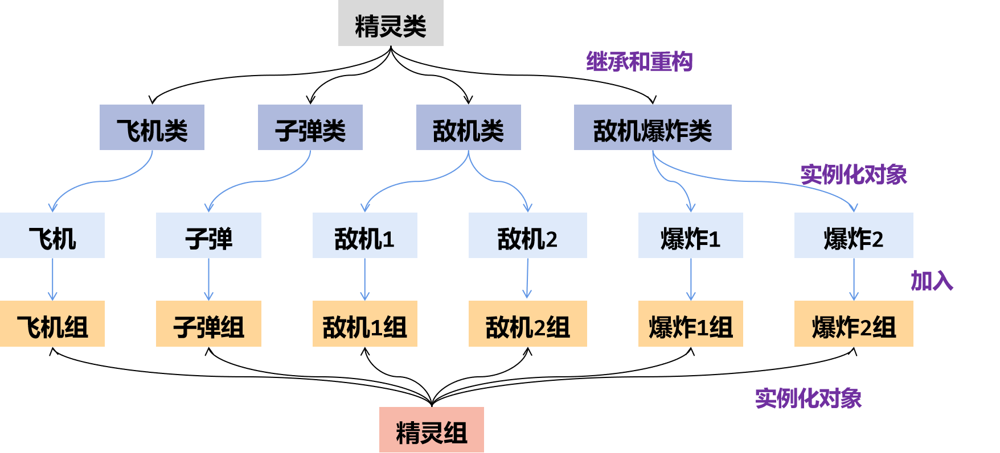
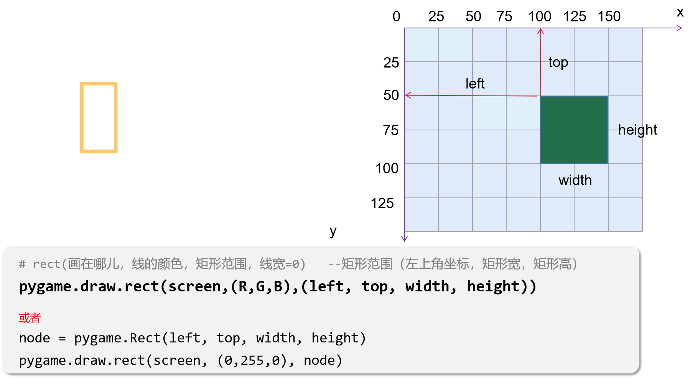
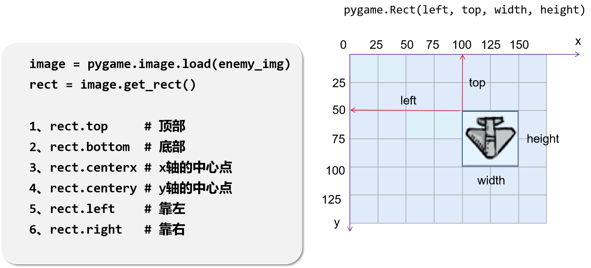
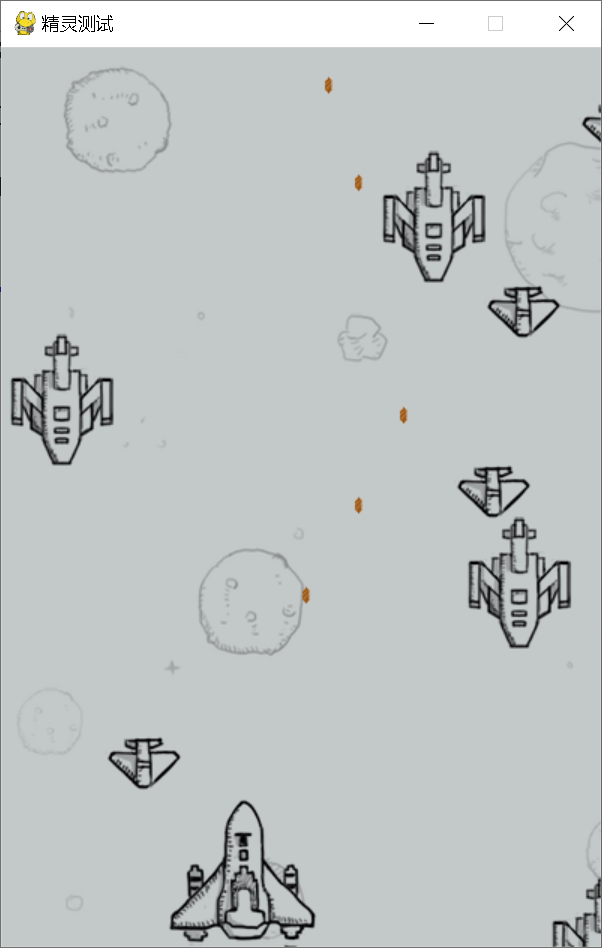

# **Lesson-15-16**

## 飞机大战











> **飞机大战代码**

飞机大战图片下载链接：<https://musetransfer.com/s/8s39vhzl2（有效期至2023年11月27日）>

```python
import pygame
import random

WIDTH = 400
HEIGHT = 600
# 自定义敌机出现事件（每隔时间从顶部出现敌机）
creat_enemy = pygame.USEREVENT

class Enemy(pygame.sprite.Sprite):
    def __init__(self, enemy_img, speed):
        pygame.sprite.Sprite.__init__(self)
        self.image = pygame.image.load(enemy_img)   # 加载图像
        self.rect = self.image.get_rect()  # 获取图像矩形位置
        self.speed = speed
        self.rect.top = 0
        self.rect.left = random.randint(0,WIDTH)
    def update(self):
        self.rect.top += self.speed
        if self.rect.top > HEIGHT:   # 如果敌机飞出屏幕，则删除敌机
            self.kill()
        
class Player(pygame.sprite.Sprite):
    def __init__(self, player_img):
        pygame.sprite.Sprite.__init__(self)
        self.image = pygame.image.load(player_img)   # 加载图像
        self.rect = self.image.get_rect()  # 获取图像矩形位置
        self.speed = 5
        self.rect.top = 500
        self.rect.left = 200
        self.ready_to_fire = 0  # 发射子弹的状态

    def update(self):
        keys_pressed = pygame.key.get_pressed()
        if keys_pressed[pygame.K_UP]:
            self.rect.top -= self.speed
        elif keys_pressed[pygame.K_DOWN]:
            self.rect.top += self.speed
        elif keys_pressed[pygame.K_LEFT]:
            self.rect.left -= self.speed
        elif keys_pressed[pygame.K_RIGHT]:
            self.rect.left += self.speed
        if keys_pressed[pygame.K_SPACE]:
            if self.ready_to_fire == 0:    # 如果按下空格，没有发射子弹的时候，发射子弹
                self.fire()
                self.ready_to_fire = 1     # 发射完子弹之后，子弹状态为1
        else:
            self.ready_to_fire = 0         # 松开空格，子弹状态变为0
            
    def fire(self):
        bullet = Bullet(r'images\bullet1.png')
        bullet.rect.left = self.rect.centerx
        bullet.rect.top = self.rect.top
        bullet_group.add(bullet)
         
class Bullet(pygame.sprite.Sprite):
    def __init__(self, bullet_img):
        pygame.sprite.Sprite.__init__(self)
        self.image = pygame.image.load(bullet_img)   # 加载图像
        self.rect = self.image.get_rect()  # 获取图像矩形位置
        self.speed = 5

    def update(self):
        self.rect.top -= self.speed
        if self.rect.top < 0:        # 如果子弹飞出屏幕，则删除子弹
            self.kill()

class Explode(pygame.sprite.Sprite):   # 爆炸
    def __init__(self, images):
        pygame.sprite.Sprite.__init__(self)
        self.images = images
        self.image_index = 0
        self.image = self.images[self.image_index]
        self.rect = self.image.get_rect()
        self.ready_to_change = 0      # 改变状态
    def update(self):
        if self.image_index < 3:
            self.ready_to_change += 1
            if self.ready_to_change % 4 == 0:
                self.image_index += 1
                self.image = self.images[self.image_index]
        else:
            self.kill()

        
pygame.init()        
screen = pygame.display.set_mode((WIDTH, HEIGHT))
pygame.display.set_caption('精灵测试')
bg = pygame.image.load(r'images\background.png')  # 注意替换为你自己的图片位置
screen.blit(bg, (0,0))
clock = pygame.time.Clock()
pygame.time.set_timer(creat_enemy, 1000)  # 每隔1000ms触发一下敌机出现事件

player = Player(r'images\me1.png')  # 注意替换为你自己的图片位置

# 飞机组，管理飞机对象
player_group = pygame.sprite.Group()
player_group.add(player)

# 子弹组，管理子弹对象
bullet_group = pygame.sprite.Group()

# 敌机组1，管理敌机1对象
enemy1_group = pygame.sprite.Group()
# 敌机组2，管理敌机2对象
enemy2_group = pygame.sprite.Group()

# 爆炸组1
explode1_group = pygame.sprite.Group()

# 爆炸组2
explode2_group = pygame.sprite.Group()

pygame.display.flip()

while True:
    clock.tick(60)
    for event in pygame.event.get():
        if event.type == pygame.QUIT:
            pygame.quit()
            exit()
        if event.type == creat_enemy:
            enemy1 = Enemy(r'images\enemy1.png', 1)
            enemy2 = Enemy(r'images\enemy2.png',2)
            enemy1_group.add(enemy1)
            enemy2_group.add(enemy2)

    # 碰撞检测  返回的值为字典信息  collision = {敌机：子弹}
    collision1 = pygame.sprite.groupcollide(enemy1_group, bullet_group, True, True)
    for enemy in collision1.keys():
        images1 = [pygame.image.load(r'images\enemy1_down1.png'),
                       pygame.image.load(r'images\enemy1_down2.png'),
                       pygame.image.load(r'images\enemy1_down3.png'),
                       pygame.image.load(r'images\enemy1_down4.png')]
        explode1 = Explode(images1)
        explode1.rect = enemy1.rect
        explode1_group.add(explode1)
        
    collision2 = pygame.sprite.groupcollide(enemy2_group, bullet_group, True, True)
    for enemy in collision2.keys():
        images2 = [pygame.image.load(r'images\enemy2_down1.png'),
                       pygame.image.load(r'images\enemy2_down2.png'),
                       pygame.image.load(r'images\enemy2_down3.png'),
                       pygame.image.load(r'images\enemy2_down4.png')]
        explode2 = Explode(images2)
        explode2.rect = enemy2.rect
        explode2_group.add(explode2)

    # 注意替换为你自己的图片位置
    
    screen.blit(bg,(0,0))

    for group in [player_group, bullet_group, enemy1_group, enemy2_group, explode1_group, explode2_group]:
        group.update()
        group.draw(screen)
    
    pygame.display.update()

```


